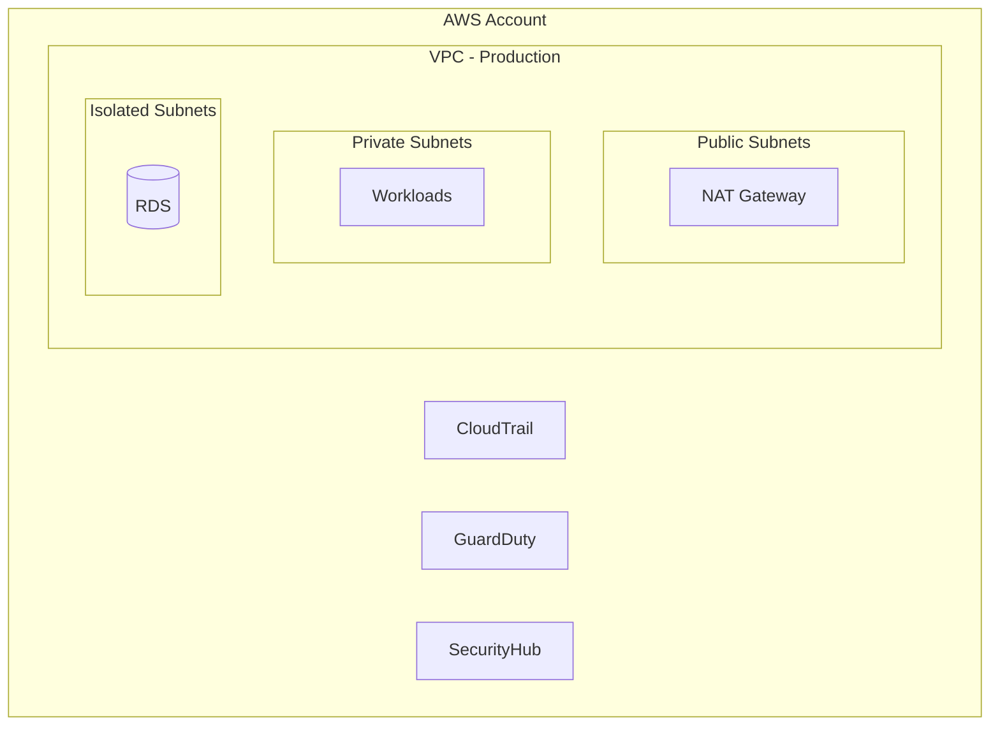

# XanCloud IaC — Documentation Generator

## Tipos de documentación

| Tipo | Ubicación | Formato | Generación |
|---|---|---|---|
| README de módulo | `modules/*/README.md` | Markdown | Auto (terraform-docs) |
| Runbooks | `docs/runbooks/` | Markdown | Manual |
| Arquitectura | `docs/architecture/` | Mermaid + Markdown | Manual |
| Onboarding | `docs/onboarding/` | Markdown | Manual |
| Troubleshooting | `docs/troubleshooting/` | Markdown | Manual |
| ADRs | `docs/DECISIONS.md` | Markdown table | Manual |

## terraform-docs

Los READMEs de módulos se auto-generan. No editarlos manualmente. Configuración:

```yaml
# .terraform-docs.yml (raíz del repo)
formatter: markdown table

sections:
  show:
    - header
    - requirements
    - providers
    - inputs
    - outputs
    - resources

content: |-
  {{ .Header }}

  ## Requirements

  {{ .Requirements }}

  ## Providers

  {{ .Providers }}

  ## Resources

  {{ .Resources }}

  ## Inputs

  {{ .Inputs }}

  ## Outputs

  {{ .Outputs }}

output:
  file: README.md
  mode: inject
  template: |-
    <!-- BEGIN_TF_DOCS -->
    {{ .Content }}
    <!-- END_TF_DOCS -->

settings:
  anchor: true
  default: true
  required: true
  type: true
```

## Runbooks

### Estructura

```markdown
# Runbook: {título}

## Contexto
Cuándo usar este runbook y qué problema resuelve.

## Pre-requisitos
- Acceso requerido
- Herramientas necesarias
- Variables/información que necesitas tener a mano

## Procedimiento
1. Paso concreto con comando
2. Siguiente paso
3. Verificación

## Rollback
Qué hacer si algo sale mal.

## Verificación
Cómo confirmar que el problema se resolvió.
```

### Runbooks de Fase 4

| Runbook | Descripción |
|---|---|
| drift-resolution.md | Detectar y resolver drift en infraestructura |
| cost-spike.md | Investigar y mitigar incremento inesperado de costos |
| security-finding.md | Responder a findings de GuardDuty/SecurityHub |
| backup-restore.md | Restaurar recursos desde AWS Backup |
| access-review.md | Auditar y limpiar permisos IAM |

### Tono de runbooks

- Directo, sin contexto innecesario.
- Cada paso es un comando ejecutable o una acción concreta.
- Si hay decisiones, presentar como if/else, no como prosa.
- Incluir los comandos exactos de `tofu` (no `terraform`).

## Diagramas de arquitectura (Mermaid)

Para diagramas, usar el skill `architecture-diagrams` si está disponible. Si no, seguir estas convenciones mínimas:



## Guías de onboarding

### Estructura

```markdown
# Onboarding: {audiencia}

## Qué es xancloud-iac
Una línea. No más.

## Setup inicial
1. Instalar OpenTofu >= 1.11
2. Configurar AWS CLI
3. Clonar el repo
4. Primer deploy en dev

## Estructura del repo
Mapa visual de directorios con descripción de una línea cada uno.

## Flujo de trabajo diario
Cómo crear un módulo, hacer PR, pasar CI, desplegar.

## Dónde buscar ayuda
Links a docs, runbooks, contacto.
```

## Checklist

- [ ] READMEs de módulos son auto-generados (no manuales)
- [ ] Runbooks tienen: contexto, pre-requisitos, procedimiento, rollback, verificación
- [ ] Diagramas en Mermaid (no imágenes estáticas)
- [ ] Comandos en docs usan `tofu` (no `terraform`)
- [ ] Documentación versionada con el proyecto
- [ ] Sin prosa innecesaria — directo al punto
