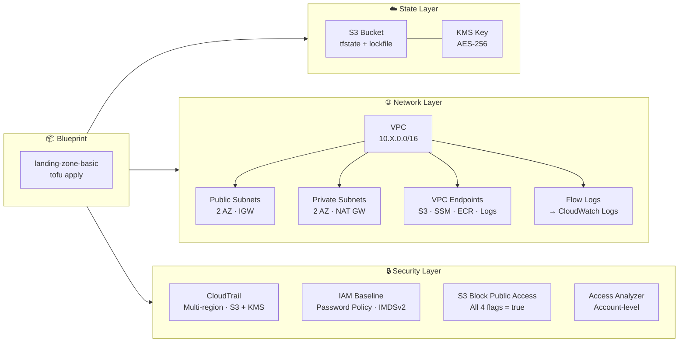

<h1 align="center">xancloud-iac</h1>

<p align="center">
  <strong>Opinionated AWS landing zone accelerator built on OpenTofu.</strong><br>
  Deploy a secure, compliant AWS foundation in hours — not months.
</p>

<p align="center">
  <a href="LICENSE"></a>
  <a href="https://opentofu.org"></a>
  <a href="https://aws.amazon.com"></a>
  
  
</p>

---

**AWS landing zones take consultancies 3–6 months and $50K–$500K to deliver.** Most SMBs can't afford that. xancloud-iac gives you pre-built modules, production-ready blueprints, and clear defaults so you don't need a dedicated DevOps team to start right.

## Why xancloud-iac

- **Hours, not months** — A single `tofu apply` deploys a secure AWS foundation with VPC, IAM hardening, CloudTrail, and encrypted state.
- **OpenTofu-first** — MPL 2.0 license, native state encryption, S3 locking without DynamoDB. No vendor lock-in.
- **Opinionated defaults** — Every resource is encrypted at rest, tagged, and follows AWS Well-Architected. Zero manual configuration.
- **Built for LATAM SMBs** — Documentation in Spanish and English. Transparent pricing, compliance-ready modules.

## Architecture



> **Layer dependency (bottom-up):** State → Network + Security → Blueprint.  
> The blueprint composes all modules; each module is independently usable.

## Quick start

```bash
# Prerequisites
tofu --version            # == 1.11+
aws sts get-caller-identity

# 1 — Bootstrap state backend (first time only)
cd modules/state-backend

CALLER_ARN=$(aws sts get-caller-identity --query Arn --output text)
cat > terraform.tfvars <<EOF
project       = "xancloud"
environment   = "dev"
bucket_name   = "xancloud-dev-tfstate-$(aws sts get-caller-identity --query Account --output text)"
allowed_roles = ["${CALLER_ARN}"]
EOF

tofu init && tofu apply

# 2 — Deploy landing zone
cd blueprints/landing-zone-basic
cp ../../environments/dev/terraform.tfvars.example terraform.tfvars
# Edit terraform.tfvars — set region to match your AWS profile

tofu init -backend-config=examples/backend-dev.hcl
tofu plan && tofu apply
```

> See [`docs/DEPLOYMENT.md`](docs/DEPLOYMENT.md) for the full step-by-step including
> state migration to S3, post-deploy verification, and clean destroy.

## What you get (41 resources)

| Resource | Details |
|----------|---------|
| **VPC** | 10.10.0.0/16, public + private subnets (2 AZs), NAT Gateway, Internet Gateway |
| **VPC Endpoints** | S3 (Gateway), SSM, SSMMessages, ECR API, ECR DKR, CloudWatch Logs (Interface) |
| **Flow Logs** | VPC Flow Logs → CloudWatch Logs |
| **CloudTrail** | Multi-region trail, S3 bucket + KMS encryption, Object Lock (364d governance) |
| **IAM Baseline** | Account alias, password policy (14 chars, 90d expiry), S3 Block Public Access, Access Analyzer, IMDSv2 required |
| **State Backend** | S3 bucket + KMS key + native lockfile (no DynamoDB) |

## Stack

| Layer | Tool | Details |
|-------|------|---------|
| **IaC** | OpenTofu >= 1.11 | State encryption, S3 native locking, MPL 2.0 |
| **Cloud** | AWS | Primary target. Largest market share. |
| **Policy** | Checkov + OPA | Static security scanning (Phase 2+) |
| **Testing** | tofu test + Terratest | Unit + integration tests (Phase 2+) |
| **CI/CD** | GitHub Actions | Automated quality gates (Phase 2+) |

## Project structure

```
modules/                  # ← Reusable modules (the product)
├── state-backend/        #    S3 + KMS, bootstrap manual
├── networking/vpc/       #    VPC, subnets, NAT, endpoints, flow logs
├── security/cloudtrail/  #    Multi-region audit trail
└── identity/iam-baseline/#    IMDSv2, S3 block public access, password policy

blueprints/               # ← Opinionated module compositions
└── landing-zone-basic/   #    Connects all 4 modules with env defaults

environments/             # ← Per-environment configuration
├── dev/                  #    terraform.tfvars.example
└── prod/                 #    terraform.tfvars.example
```

## Who is this for

| Audience | Problem xancloud-iac solves |
|----------|----------------------------|
| **SMBs starting on AWS** | Security and compliance from day one, without a DevOps team |
| **Mid-size companies** | Existing infra that's manually managed, drifting, and costing too much |
| **Consultants & freelancers** | A repeatable, professional-grade starting point for client engagements |

## Why OpenTofu over Terraform

OpenTofu is the open-source fork of Terraform under the MPL 2.0 license. After IBM's acquisition of HashiCorp and the BSL license change, OpenTofu provides freedom from vendor lock-in, predictable licensing, and features like native state encryption and S3 locking without DynamoDB — making it the better foundation for new projects in 2026.

## Roadmap

- [x] **Phase 0** — Validation + Go-to-Market ✅
- [x] **Phase 1** — Minimum Viable Product ✅ *(v0.1.0 released)*
- [ ] **Phase 2** — Industrialization *(requires first client)* — CI/CD, Checkov, tofu test, terraform-docs
- [ ] **Phase 3** — Scale or Pivot *(requires real data)*

See [`docs/`](docs/) for full project context, design decisions, and phased roadmap.

## Project status

This is a **pre-1.0 MVP** built and validated by a solo developer. It works (deploy → verify → destroy tested end-to-end), but expect rough edges until Phase 2.

**Known limitations:**
- Single AWS account (no Organizations)
- No CI/CD pipeline yet
- No automated tests
- Documentation in progress (some sections in Spanish only)

## Contributing

This project is in early stage. Feedback, issues, and PRs are welcome:

1. Install the pre-push hook: `git config core.hooksPath .githooks`
2. Create a branch: `docs/`, `fix/`, `chore/`, or `feature/` prefix
3. Commit using [Conventional Commits](https://www.conventionalcommits.org/)
4. Open a PR to `main` (direct pushes are blocked by hook + branch protection)

See [`AGENTS.md`](AGENTS.md) for full conventions.

## License

[Apache 2.0](LICENSE)