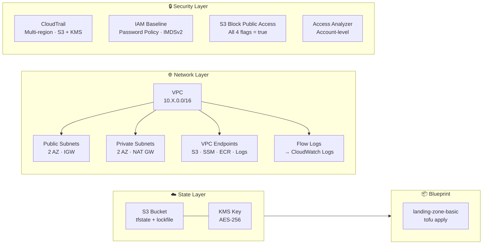

<h1 align="center">xancloud-iac</h1>

<p align="center">
  <strong>Opinionated AWS landing zone accelerator built on OpenTofu.</strong><br>
  Deploy a secure, compliant AWS foundation in hours — not months.
</p>

<p align="center">
  <a href="LICENSE"></a>
  <a href="https://opentofu.org"></a>
  <a href="https://aws.amazon.com"></a>
  
  
</p>

---

**A production-grade AWS landing zone skeleton.** Pre-built OpenTofu modules with secure defaults, encryption everywhere, and clear conventions — deploy in hours, not months. Open source under Apache 2.0.

## Why xancloud-iac

- **Hours, not months** — A single `tofu apply` deploys a secure AWS foundation with VPC, IAM hardening, CloudTrail, and encrypted state.
- **OpenTofu-first** — MPL 2.0 license, native state encryption, S3 locking without DynamoDB. No vendor lock-in.
- **Opinionated defaults** — Every resource is encrypted at rest, tagged, and follows AWS Well-Architected. Zero manual configuration.
- **Built for the community** — Project docs in Spanish, module docs in English. Fork it, adapt it, build on it.

## The OpenCore model

This is the **open-source foundation** — a production-grade landing zone skeleton with 4 reusable modules and a composable blueprint. It gives you:

- ✅ A secure, auditable AWS foundation in a single `tofu apply`
- ✅ Encrypted state, hardened IAM, multi-region CloudTrail, VPC with flow logs
- ✅ OpenTofu-native, no proprietary lock-in

**Your turn:** Deploy your own resources on top — EKS clusters, RDS databases, Lambda functions, whatever your workload needs. xancloud-iac handles the boring-but-critical infrastructure layer so you focus on application code.

> This repository is the open part of the OpenCore model. Proprietary extensions (multi-account, SSO, advanced security) live in companion repositories for consulting clients.

## Architecture


```mermaid
%%{init: {"flowchart": {"htmlLabels": false}} }%%
flowchart LR
    subgraph STATE["☁️ State Layer"]
        direction LR
        S3["S3 Bucket<br/>tfstate + lockfile"] --- KMS["KMS Key<br/>AES-256"]
    end

    subgraph NET["🌐 Network Layer"]
        direction TB
        VPC["VPC<br/>10.X.0.0/16"] --> PUB["Public Subnets<br/>2 AZ · IGW"]
        VPC --> PRIV["Private Subnets<br/>2 AZ · NAT GW"]
        VPC --> EP["VPC Endpoints<br/>S3 · SSM · ECR · Logs"]
        VPC --> FL["Flow Logs<br/>→ CloudWatch Logs"]
    end

    subgraph SEC["🔒 Security Layer"]
        direction TB
        CT["CloudTrail<br/>Multi-region · S3 + KMS"] 
        IAM["IAM Baseline<br/>Password Policy · IMDSv2"]
        S3BPA["S3 Block Public Access<br/>All 4 flags = true"]
        AA["Access Analyzer<br/>Account-level"]
    end

    subgraph BP["📦 Blueprint"]
        LZ["landing-zone-basic<br/>tofu apply"]
    end

    STATE --> BP
```

> **Dependency:** State Backend (bootstrap first) → Blueprint  
> The blueprint composes all modules independently. No cross-module dependencies.

## Quick start

```bash
# Prerequisites
tofu --version            # == 1.11+
aws sts get-caller-identity

# 1 — Bootstrap state backend (first time only)
cd modules/state-backend

CALLER_ARN=$(aws sts get-caller-identity --query Arn --output text)
cat > terraform.tfvars <<EOF
project       = "xancloud"
environment   = "dev"
bucket_name   = "xancloud-dev-tfstate-$(aws sts get-caller-identity --query Account --output text)"
allowed_roles = ["${CALLER_ARN}"]
EOF

tofu init && tofu apply

# 2 — Deploy landing zone
cd blueprints/landing-zone-basic
cp ../../environments/dev/terraform.tfvars.example terraform.tfvars
# Edit terraform.tfvars — set region to match your AWS profile

tofu init -backend-config=examples/backend-dev.hcl
tofu plan && tofu apply
```

> See [`docs/DEPLOYMENT.md`](docs/DEPLOYMENT.md) for the full step-by-step including
> state migration to S3, post-deploy verification, and clean destroy.

## What you get

| Resource | Details |
|----------|---------|
| **VPC** | 10.10.0.0/16, public + private subnets (2 AZs), NAT Gateway, Internet Gateway |
| **VPC Endpoints** | S3 (Gateway), SSM, SSMMessages, ECR API, ECR DKR, CloudWatch Logs (Interface) |
| **Flow Logs** | VPC Flow Logs → CloudWatch Logs |
| **CloudTrail** | Multi-region trail, S3 bucket + KMS encryption, Object Lock (364d governance) |
| **IAM Baseline** | Account alias, password policy (14 chars, 90d expiry), S3 Block Public Access, Access Analyzer, IMDSv2 required |
| **State Backend** | S3 bucket + KMS key + native lockfile (no DynamoDB) |

## 💰 Estimated AWS costs

Infrastructure costs scale with your configuration. Ballpark monthly estimates (us-east-1):

| Resource | Dev (single NAT, 2 AZs) | Prod (per-AZ NAT, 3 AZs) |
|----------|--------------------------|---------------------------|
| **NAT Gateway** | ~$33/mo (×1) | ~$99/mo (×3) |
| **VPC Interface Endpoints** | ~$22/mo (×3) | ~$36/mo (×5) |
| **KMS keys** (state + trail) | ~$2/mo | ~$2/mo |
| **CloudTrail** (mgmt events) | ~$5/mo | ~$5/mo |
| **CloudWatch Logs** | ~$3/mo | ~$5/mo |
| **Total** | **~$65/mo** | **~$147/mo** |

> Numbers are estimates based on [AWS NAT Gateway pricing](https://aws.amazon.com/vpc/pricing/) at $0.045/hr + $0.045/GB. Use the [AWS Pricing Calculator](https://calculator.aws/) for your specific region and data transfer patterns. Gateway endpoints (S3, DynamoDB) are free.

## Stack

| Layer | Tool | Details |
|-------|------|---------|
| **IaC** | OpenTofu >= 1.11 | State encryption, S3 native locking, MPL 2.0 |
| **Cloud** | AWS | Primary target. Largest market share. |

## Project structure

```
modules/                  # ← Reusable modules (the product)
├── state-backend/        #    S3 + KMS, bootstrap manual
├── networking/vpc/       #    VPC, subnets, NAT, endpoints, flow logs
├── security/cloudtrail/  #    Multi-region audit trail
└── identity/iam-baseline/#    IMDSv2, S3 block public access, password policy

blueprints/               # ← Opinionated module compositions
└── landing-zone-basic/   #    Connects all 4 modules with env defaults

environments/             # ← Per-environment configuration
├── dev/                  #    terraform.tfvars.example
└── prod/                 #    terraform.tfvars.example
```

## Who is this for

| Audience | Problem xancloud-iac solves |
|----------|----------------------------|
| **SMBs starting on AWS** | Security and compliance from day one, without a DevOps team |
| **Mid-size companies** | Existing infra that's manually managed, drifting, and costing too much |
| **Consultants & freelancers** | A repeatable, professional-grade starting point for client engagements |

## Why OpenTofu over Terraform

OpenTofu is the open-source fork of Terraform under the MPL 2.0 license. After IBM's acquisition of HashiCorp and the BSL license change, OpenTofu provides freedom from vendor lock-in, predictable licensing, and features like native state encryption and S3 locking without DynamoDB — making it the better foundation for new projects in 2026.

## Model

This is the **open foundation** of the OpenCore model. It provides a secure, production-grade landing zone skeleton with reusable modules.

**What's here (open source):**
- 4 reusable modules + 1 composable blueprint
- Encrypted state backend, VPC, CloudTrail, IAM hardening
- Ready to deploy in a single `tofu apply`

**What's private (consulting clients):**
- Multi-account architecture (AWS Organizations)
- CI/CD pipelines (GitHub Actions + OIDC)
- Policy scanning (Checkov/OPA), automated testing
- SSO (IAM Identity Center), GuardDuty, SecurityHub
- English translations of project docs

The community is free to fork, adapt, and build on this foundation.

See [`docs/`](docs/) for full project context, design decisions, and phased roadmap.

## Project status

**This is the open foundation — maintained as-is.** The modules work, the blueprint deploys, and the conventions are documented. Build on top, fork it, or use it as a reference. Private extensions exist for consulting clients; they are not part of this repository.

**Known limitations:**
- Single AWS account (no Organizations)
- No CI/CD, no automated tests, no policy scanning
- Project documentation in Spanish; module documentation in English

## Contributing

This project is in early stage. Feedback, issues, and PRs are welcome:

1. Install the pre-push hook: `git config core.hooksPath .githooks`
2. Create a branch: `docs/`, `fix/`, `chore/`, or `feature/` prefix
3. Commit using [Conventional Commits](https://www.conventionalcommits.org/)
4. Open a PR to `main` (direct pushes are blocked by hook + branch protection)

See [`AGENTS.md`](AGENTS.md) for full conventions.

## License

[Apache 2.0](LICENSE)